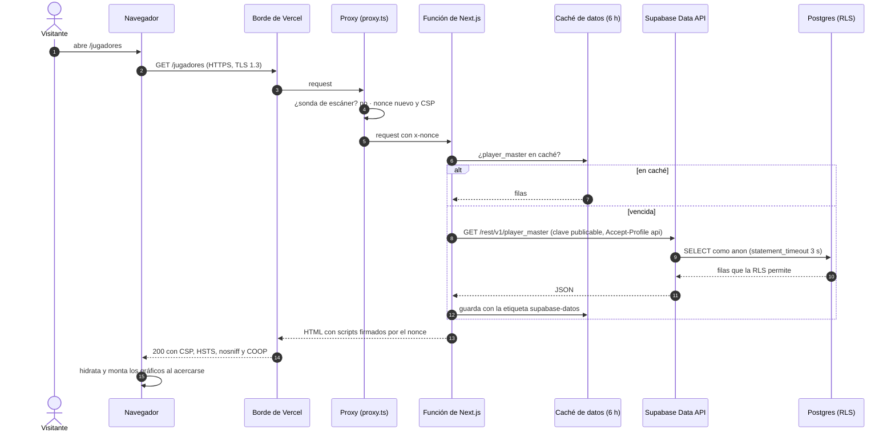
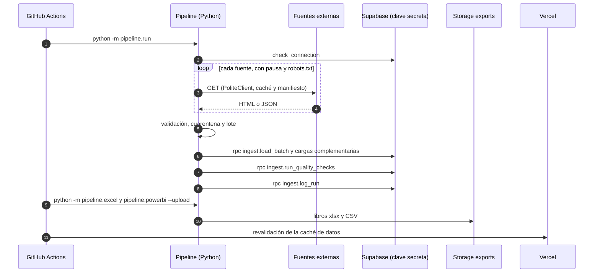
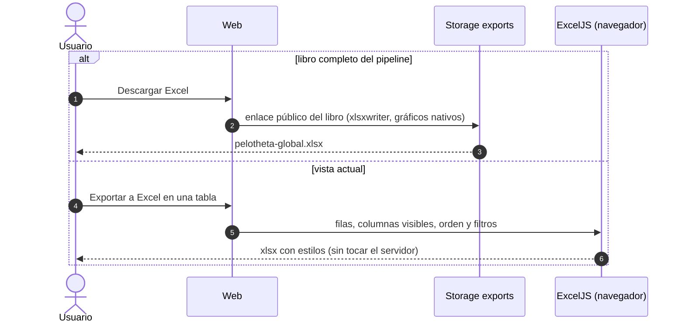

# Diagramas de secuencia

## Carga de una página con datos

```mermaid
sequenceDiagram
    autonumber
    actor V as Visitante
    participant B as Navegador
    participant E as Borde de Vercel
    participant P as Proxy (proxy.ts)
    participant F as Función de Next.js
    participant C as Caché de datos (6 h)
    participant S as Supabase Data API
    participant DB as Postgres (RLS)
    V->>B: abre /jugadores
    B->>E: GET /jugadores (HTTPS, TLS 1.3)
    E->>P: request
    P->>P: ¿sonda de escáner? no · nonce nuevo y CSP
    P->>F: request con x-nonce
    F->>C: ¿player_master en caché?
    alt en caché
        C-->>F: filas
    else vencida
        F->>S: GET /rest/v1/player_master (clave publicable, Accept-Profile api)
        S->>DB: SELECT como anon (statement_timeout 3 s)
        DB-->>S: filas que la RLS permite
        S-->>F: JSON
        F->>C: guarda con la etiqueta supabase-datos
    end
    F-->>E: HTML con scripts firmados por el nonce
    E-->>B: 200 con CSP, HSTS, nosniff y COOP
    B->>B: hidrata y monta los gráficos al acercarse
```

## Corrida del workflow mensual

```mermaid
sequenceDiagram
    autonumber
    participant GH as GitHub Actions
    participant PL as Pipeline (Python)
    participant FU as Fuentes externas
    participant S as Supabase (clave secreta)
    participant ST as Storage exports
    participant V as Vercel
    GH->>PL: python -m pipeline.run
    PL->>S: check_connection
    loop cada fuente, con pausa y robots.txt
        PL->>FU: GET (PoliteClient, caché y manifiesto)
        FU-->>PL: HTML o JSON
    end
    PL->>PL: validación, cuarentena y lote
    PL->>S: rpc ingest.load_batch y cargas complementarias
    PL->>S: rpc ingest.run_quality_checks
    PL->>S: rpc ingest.log_run
    GH->>PL: python -m pipeline.excel y pipeline.powerbi --upload
    PL->>ST: libros xlsx y CSV
    GH->>V: revalidación de la caché de datos
```

## Exportación a Excel

```mermaid
sequenceDiagram
    autonumber
    actor U as Usuario
    participant W as Web
    participant ST as Storage exports
    participant X as ExcelJS (navegador)
    alt libro completo del pipeline
        U->>W: Descargar Excel
        W->>ST: enlace público del libro (xlsxwriter, gráficos nativos)
        ST-->>U: pelotheta-global.xlsx
    else vista actual
        U->>W: Exportar a Excel en una tabla
        W->>X: filas, columnas visibles, orden y filtros
        X-->>U: xlsx con estilos (sin tocar el servidor)
    end
```
